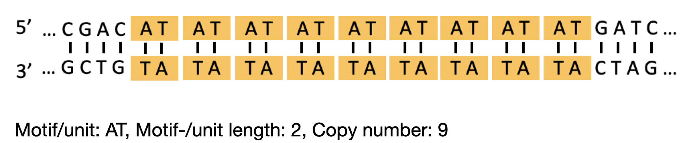
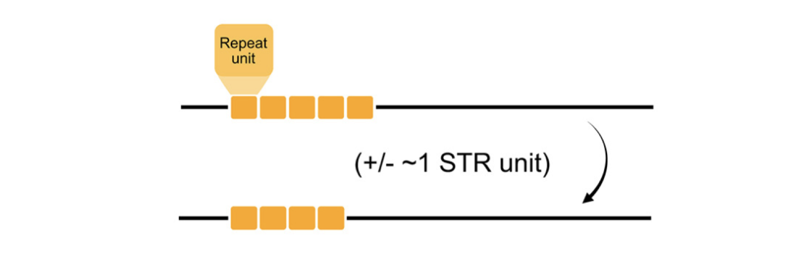

# Bioinfo4B-STR  
Short tandem repeat project for the course "Bioinformatics for Beginners"  

## Background  

Short tandem repeats (STRs) are consecutive repetitions of 1-6 basepair (bp) motifs. They are estimated to make up around 3% of the human genome. Below is an example STR locus:  

  

STRs are a rich source of genomic variation, with some loci having mutation rates up to a 10000 times higher than point mutations. STR mutations are typically the result of DNA polymerase slippage during replication, where strand misalignment after polymerase detachment results in the insertion or deletion of one or more repeat units at a STR locus:  



If you would like some more background on STRs, the way they mutate, and why they are relevant, you can have a look at this [review](https://onlinelibrary.wiley.com/doi/full/10.1111/jeb.14106). Reading the Abstract & Introduction sections will provide an overview of our current knowledge of STRs, whereas the later sections are deep-dives of more specific STR characteristics.

This project aims to introduce standard bioinformatics tasks such as short-read sequence alignment, variant calling, and variant interpretation on STRs. The scenario is as follows: there is a patient with a suspected genetic defect whose genome has been sequencenced. Given the sequencing samples, your task is to align them to a reference genome, process the alignment, and look for genetic variants. Finally, you will need to investigate the possible functional effects of any detected variant to see if they could explain the patient's symptoms.  

*Note: to keep this process managable, we will focus on only a single gene: the APC gene. The sequencing reads that you'll be using from this project were simulated from the APC reference sequence using [wgsim](https://github.com/lh3/wgsim).*


## Setting up  

Before getting started, open a terminal, navigate to this directory, and set up the conda environment as follows:  

```sh
conda create -f environment.yaml
```

*Note: if you are using Windows, it is highly recommended to set up [Windows Subsystem for Linux](https://learn.microsoft.com/en-us/windows/wsl/install). This will give you access to a Linux distribution right in your Windows machine, allowing you to perform all tasks for this project yourself. Otherwise, you can create the Windows conda environment in this folder (`conda create -f environment_windows.yaml`). This env will allow you to work through the Jupyter notebook and read along, but someone else will need to run the bioinformatics workflow for you.*  

Once all the dependencies are installed, activate the environment like this:  

```sh
conda activate Bioinfo4B-STR
```

## Short read alignment

Then, navigate to the folder `scripts/bash_scripts/`. Here, you will find a number of bash scripts to run the bioinformatics workflow for this project. The first three scripts (`01_bwa-mem2_index.sh`, `02_bwa-mem2_alignment.sh`, and `03_process_alignment.sh`) map the input reads to the *APC* reference sequence, and process the alignment. Read through these scripts: most of these steps should be familiar to you at this point. Once you understand all the steps performed in the first three scripts, run them --- in order --- one after the other.  
**Important: make sure you are in the `scripts/bash` directory, otherwise the scripts will not work properly**  

Once you've run the scripts, check the directories in the `data/` folder to make sure all output files were generated properly (e.g. you should find `APC_mut.bam` and `APC_mut.bam.bai` files in `data/alignments/`).  

## STR genotyping using GangSTR

Now, navigate back to `scripts/bash_scripts/`, and inspect the file `04_run_gangstr.sh`. This file is incomplete at the moment. Your task is to determine how to run GangSTR (a short tandem repeat genotyping tool) from the command line. You will need to give GangSTR a reference genome (`data/reference/APC.fa`), an alignment (`data/alignments/APC_mut.bam`), a 'regions file', which tells GangSTR which STR loci we want to genotype (`data/repeats/APC_repeats.tsv`), and finally, a name to use as a basis for the output files (e.g. `APC_mut`). You can figure out how to specify to GangSTR where to find these files by running:  

```sh
GangSTR --help
```

Alternatively, have a look at the documentation in [GangSTR's Github repo](https://github.com/gymreklab/gangstr).  

GangSTR should generate three output files: one with extension `.vcf`, one with `samplestats.tab`, and one with `insdata.tab`. If you see these files, proceed to run the Jupyter notebook `scripts/notebooks/identify_mutation.ipynb`, and follow along with the tasks in there.  
